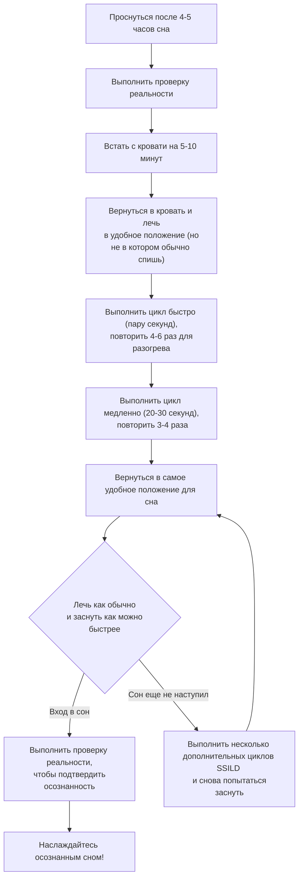

---
{"dg-publish":true,"permalink":"/pro-ssild/"}
---

# Введение
Все техники LD (lucid dreaming) вертятся вокруг одного понятия: непрямой вход в осознанный сон. Непрямые техники — это про то, что мы просыпаемся раньше времени и погружаемся обратно в сон, но уже осознанно. 

Сетап везде один: встаем раньше обычного (где-то спустя 4-5 часов после того, как легли спать), ходим-бродим 5-10 минут, чтобы разогнать сознание, а потом идем ложимся спать.

# Конкретно про SSILD
Дальше есть много разных техник, но интересна сейчас SSILD (Senses Initiated Lucid Dream). Принцип ее лежит на понятии цикла:
> Цикл — последовательная фокусировка на визуальных, аудиальных и сенсорных ощущениях. Без попытки почувствовать что-то нестандартное.

Схема действий такова:

## Особенности
- Одна из самых проверенных техник
- Достаточно четкая инструкция без требований увидеть какие-то гипнагогические визуалы.
- При постоянном использовании эффект только усиливается, а не увядает (по крайней мере так пишут)
- Придумали китайцы, долгое время была популярна на форуме сновидцев там

## Мой опыт
В среднем засыпаю в 23:30
# 06.04, прошлая суббота
- Уснул в 22:55
- Будильник прозвенел в 04:00. Я выключил его, пытался встать, но начал засыпать.
- В 04:30 я смог проснуться и но поленился походить по хате. Перевернулся на спину, так как не привык так спать.
- Начал выполнять циклы. Делал в среднем их по 10 секунд, не делал разминку, забыл про нее. Ничего необычного не видел, не слышал и так далее. Выполнил где-то 4-5 циклов и лег спать. Не мог уснуть какое-то время, в итоге провалился в сон неосознанно.
# 07.04, прошлое воскресение
- Уснул в 23:15
- Будильник прозвенел в 04:00. я смог встать и походил по хате минуты 4. Вернулся обратно и лег так, как обычно сплю
- Начал выполнять циклы. Делал также, как и в прошлый раз, только больше циклов. Ничего необычного не видел, не слышал и так далее. Выполнил где-то 6-7 циклов и лег спать. Не мог уснуть какое-то время, в итоге провалился в сон неосознанно.
# 12.04, эта пятница
- Уснул в 23:38
- Будильник прозвенел в 05:00
- Встал, ходил минут 5-6. Съел печеньку
- Лег на спину, сделал разминку и перешел к длинным циклам. Очень быстро терял фокусировку, забывал о том что делаю. В итоге делал где-то также секунд 10. 4 раза. В итоге повернулся в позу удобную для сна и уснул сразу.

# 13.04, эта суббота, неудачная попытка
- Уснул сильно позже (в 01:10)
- Будильник прозвенел в 06:00. Слишком хотел спать, скипнул.

# Что дальше
Думаю пробовать дальше четко исполнять технику, а также увеличивать время бодрости до 10 минут. Потому что все еще слишком быстро засыпаю. В остальном мне все нравится, это не так душно, как пытаться ощутить что-то, чего сам не понимаешь, просто делаешь упражнения, в которых все понятно. Причем достаточно быстро.

Так как любая подобная техника подразумевает депривацию, то практиковать ее планирую ограниченно по выходным.

Все еще верю и надеюсь, что эта техника способна выдавать результат (желательно стабильный). Также продолжаю вести дневник снов (с пространственными описаниями) и делать проверки реальности.